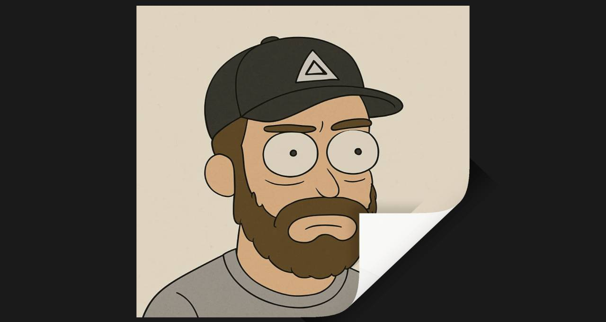

# Three.js Paper Curl

Эффект загибающегося угла бумаги на скролле: изображение рендерится в WebGL-шейдере
и «отгибается» из правого нижнего угла к левому верхнему по мере прокрутки.

[Смотреть](https://alexbulanovgooddev.github.io/threejs-paper-curl/)

